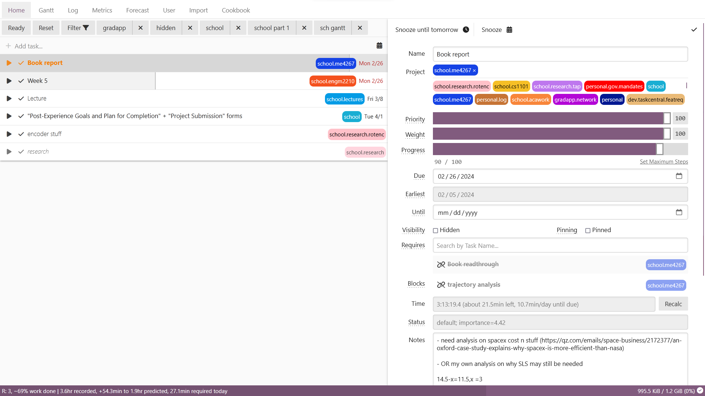

1. [Philosophy](#philosophy)
2. [Screenshots](#screenshots)
4. [Sign Up](#the-platform)

## Philosophy

TaskCentral is an opinionated TODO-style platform aiming to **reduce cognitive load** by displaying only relevant tasks at a given moment. Inspired by operating system kernel algorithms, it recommends users what to work on next to **guarantee maximum throughput**.

Users input **priority** (task importance), **weight** (work volume), and an earliest possible start date. Instead of an overwhelming list, you receive a concise daily task selection.

You can use it as a simple list if you'd like. But it can scale to your workflow: **stress forecast, Pomodoro timers, time tracking, productivity graphs**, etc.

Read more here: [The Cookbook](docgen/cookbook.md)

Interested in trying out? [Sign up here](https://docs.google.com/forms/d/e/1FAIpQLSczc8NBAMxY-9PZbda7xmbfMyiSVn6H3UEaBHoq_7BEegP9kw/viewform?usp=sf_link)

The platform is eternally free.

### Screenshots

## The Platform
Originally, I developed this platform for personal use. The platform is open to public and eternally free-for-use. Because I am hosting this with personal funds, I use Google Forms to prevent too many accounts overloading the server.

[Sign Up Here](https://docs.google.com/forms/d/e/1FAIpQLSczc8NBAMxY-9PZbda7xmbfMyiSVn6H3UEaBHoq_7BEegP9kw/viewform?usp=sf_link)
