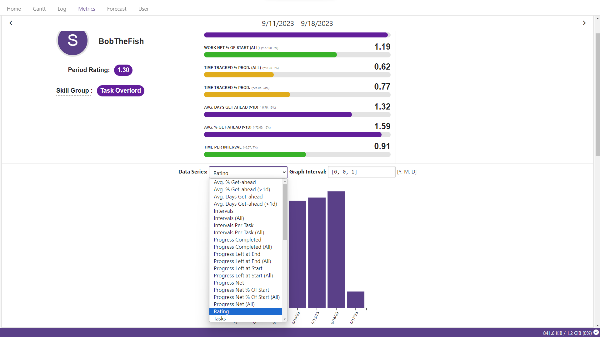

### TaskCentral is a free online platform that manages your TODO list, time tracking, Gantt charts, and more.

1. [Introduction](#introduction)
2. [Philosophy](#philosophy)
3. [Screenshots](#screenshots)
4. [The Platform & How to Sign Up](#the-platform)

## Philosophy

The user must be able to input task information with **minimal effort and time**. The algorithm is then responsible for calculating the best task to be performed next so that **throughput** is maximized.

## Screenshots

## The Platform
Originally, I developed this platform for personal use. Many of my friends have since requested access. This platform is now open to public and eternally free-for-use.

I'm too lazy to implement a sign-up page. Please open an issue so that I can get you an account.

Of course, you can always just clone this repo and self-host.
